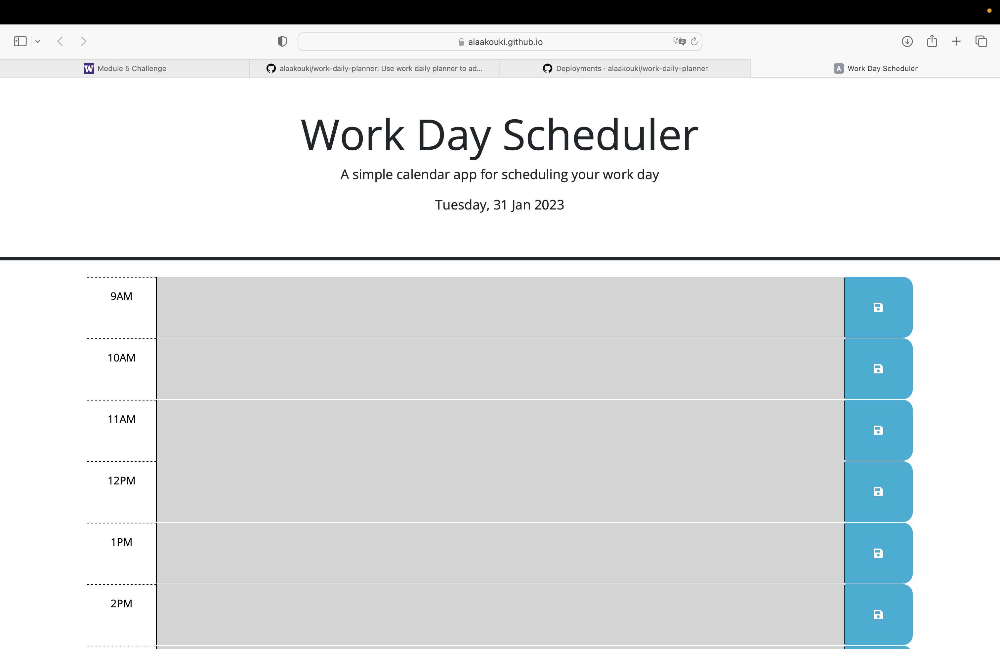
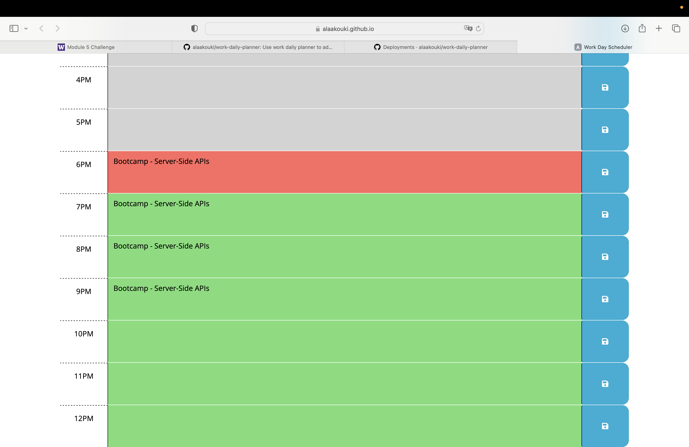

# work-daily-planner
Use work daily planner to add &amp; organize your important events and manage your time effectively.

## Way to use it:
* It's designed for work daily hours so you can use it between 09 AM till 12 PM.
* You can find day & date within the header (last line).
* For more organization and to be easier for user to use, past hours mentioned in gray color, present hour in red and for upcoming future hours in green color.
* All you need to do is write your event and press save button to be saved and check it later.

## Mock-up
 work daily planner webpage URL:
 https://alaakouki.github.io/work-daily-planner/

The following image is how work daily planner webpage shows to
users on desktop screens:

